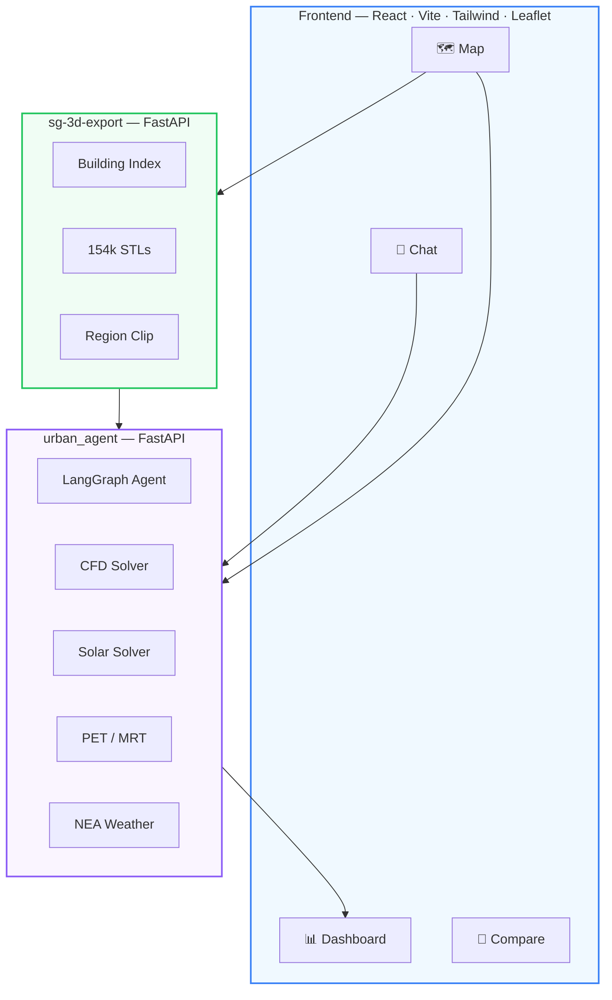
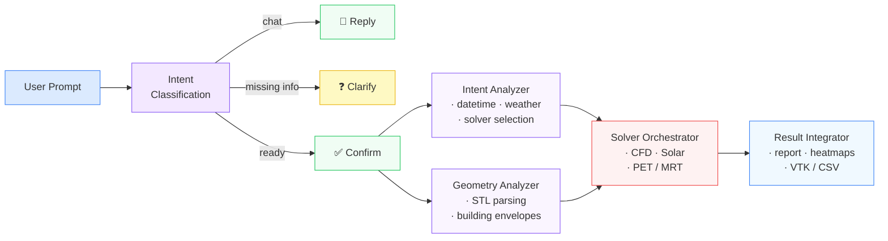

<div align="center">

# Urban Cooling Agent

**Talk to your city. Simulate its climate.**

[](https://pgupdn.github.io/urban-cooling-agent/)
[](LICENSE)
[](https://react.dev)
[](https://fastapi.tiangolo.com)
[](https://langchain-ai.github.io/langgraph/)

<br/>

*Describe an urban scenario in plain English. Select a district on the map.*
*The agent fetches live weather, prepares 3D geometry, runs coupled CFD + solar solvers,*
*and delivers a full thermal comfort report — automatically.*

<br/>

[Live Demo](https://pgupdn.github.io/urban-cooling-agent/) · [Quick Start](#quick-start) · [Architecture](#architecture) · [API Docs](#api-reference)

</div>

---

<br/>

## What It Does

> *"Run a coupled CFD + solar audit for the inter-monsoon period, emphasizing district comfort and energy demand"*

That's all it takes. The agent handles the rest:

| Step | What happens |
|:-----|:-------------|
| **Understand** | LLM parses your intent, extracts temporal & spatial parameters |
| **Clarify** | Asks for missing details (time period, location) before committing compute |
| **Confirm** | Presents a scenario summary — you approve before solvers run |
| **Simulate** | Coupled CFD wind field, solar irradiance ray-tracing, PET & MRT computation |
| **Report** | Narrative analysis, heatmaps, temporal profiles, downloadable VTK & CSV |

<br/>

## Features

<table>
<tr>
<td width="50%">

### Conversational Interface
Natural language input with intent classification. The agent knows when to chat, when to clarify, and when to simulate.

### Interactive Map
8 preset Singapore districts + freehand rectangle selection over **154,667 buildings**. Real-time building count as you draw.

### Live Progress
Watch solvers run in real time — weather data, geometry stats, and parameters stream to the UI as each pipeline stage completes.

</td>
<td width="50%">

### Results Dashboard
PET/MRT heatmaps, temporal bar charts, wind field parameters. All artifacts downloadable as VTK meshes or CSV.

### Scenario Comparison
Run multiple simulations and compare them side by side — different time periods, regions, or cooling strategies.

### Persistent Sessions
Chat history, selected region, simulation results, and active tab all survive page refreshes.

</td>
</tr>
</table>

<br/>

## Architecture



### Simulation Pipeline



<br/>

## Quick Start

### Prerequisites

- **Node.js** 18+ &nbsp;·&nbsp; **Python** 3.10+ &nbsp;·&nbsp; **OpenAI API key**

### 1 &nbsp; Clone & install

```bash
git clone https://github.com/PgUpDn/urban-cooling-agent.git
cd urban-cooling-agent && npm install
```

### 2 &nbsp; Start the frontend

```bash
npm run dev
```

### 3 &nbsp; Start the simulation backend

```bash
cd backend/urban_agent
python -m venv .venv && source .venv/bin/activate
pip install -r requirements.txt
cp config_template.py config.py   # then set OPENAI_API_KEY
python api_server.py
```

### 4 &nbsp; Start the geometry backend

```bash
cd backend/sg-3d-export
python -m venv .venv && source .venv/bin/activate
pip install -r requirements.txt
python main.py
```

> [!NOTE]
> The building STL dataset (~730 MB, 154k files) is not bundled in this repo.
> Contact the author for access, or plug in your own geometry.

<br/>

## Configuration

| Variable | Required | Description |
|:---------|:--------:|:------------|
| `OPENAI_API_KEY` | ✅ | Set in `backend/urban_agent/config.py` |
| `GEMINI_API_KEY` | — | Optional chat fallback |
| `BACKEND_API_URL` | Deploy | Public backend URL (GitHub Actions secret) |
| `VITE_BASE_PATH` | Deploy | Subpath for GitHub Pages |

<br/>

## Deployment

**GitHub Pages** — pushes to `main` auto-deploy via GitHub Actions. Set `BACKEND_API_URL` as a repo secret.

**Self-hosted** — reference config in `nginx-cooling.conf`:

```
/cooling/          →  frontend static files
/cooling/api/      →  urban_agent backend
/cooling/geo-api/  →  sg-3d-export backend
```

<br/>

## API Reference

<details>
<summary><strong>Simulation Service</strong> — <code>urban_agent</code></summary>

<br/>

| Endpoint | Method | Description |
|:---------|:------:|:------------|
| `/api/health` | GET | Health check |
| `/api/chat` | POST | Intent classification → chat / clarify / confirm / analyze |
| `/api/simulation/start` | POST | Launch simulation pipeline |
| `/api/simulation/{id}/status` | GET | Poll progress |
| `/api/simulation/{id}/messages` | GET | Incremental status messages |
| `/api/simulation/{id}/params` | GET | Live solver parameters |
| `/api/simulation/{id}/results` | GET | Final results and artifacts |
| `/api/files/{path}` | GET | Serve generated files (images, VTK, CSV) |

</details>

<details>
<summary><strong>Geometry Service</strong> — <code>sg-3d-export</code></summary>

<br/>

| Endpoint | Method | Description |
|:---------|:------:|:------------|
| `/api/region/count` | GET | Count buildings in lat/lon bounds |
| `/api/region/prepare` | POST | Prepare per-building STL directory |
| `/api/districts` | GET | List Singapore districts |
| `/api/district/{id}/buildings` | GET | Buildings in a district |
| `/api/export/clip` | POST | Clip and export STL |

</details>

<br/>

## Tech Stack

| | |
|:--|:--|
| **Frontend** | React 19 · TypeScript · Tailwind CSS · Vite 6 · Leaflet · Recharts |
| **Agent** | LangGraph · OpenAI GPT-4o |
| **Backends** | FastAPI · Python 3.12 |
| **Solvers** | Custom CFD · Solar irradiance (ray-tracing) · PET/MRT |
| **Data** | 154,667 Singapore building models (STL) · NEA real-time weather |
| **CI/CD** | GitHub Actions → GitHub Pages |

<br/>

## Author

Dr. Xinyu Yang from A*STAR IHPC (yang_xinyu@a-star.edu.sg)

</div>
